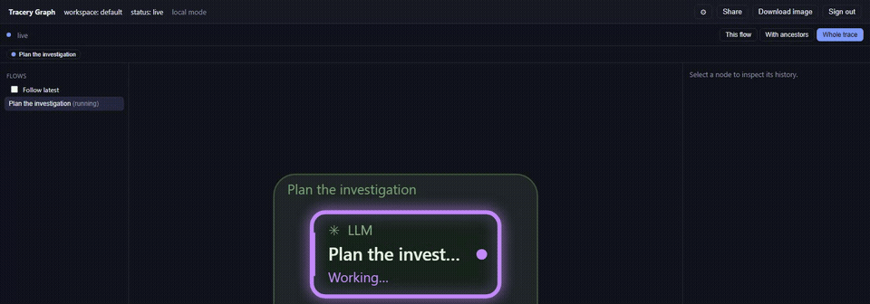

# Tracery

> **v0.1.0 is available from source. npm/PyPI packages and Docker images are not published yet.**
> The current checkout prepares v0.1.1; see [Publishing](docs/PUBLISHING.md) for the GitHub Actions release and credential setup.
> `npx @atriarch-systems/tracery-hub` and `docker pull atriarchsystems/tracery-hub` will not work
> until registry publication. Use the commands below (Node.js >=22.13), or try the
> [hosted demo](https://atriarch.systems/demos/tracery/). See [release notes](CHANGELOG.md).

```sh
git clone --branch v0.1.0 https://github.com/Atriarch-Systems/tracery.git
cd tracery
npm ci
npm run build
node apps/hub/bin/hub.mjs
```

Open http://127.0.0.1:8971/ui/ for the local hub.


<p align="center">
  <a href="https://github.com/Atriarch-Systems/tracery/actions/workflows/ci.yaml"></a>
</p>

<p align="center">
  
</p>

<p align="center">
  <em>An orchestrator plans, searches, and spawns two subagents — one succeeds, one hits an error — while a guard
  check and a human approval run alongside them. Captured live from the real hosted UI; no editing.
  More in <a href="docs/DEMOS.md">docs/DEMOS.md</a>.</em>
</p>

Tracery by Atriarch Systems turns agent activity events into live, inspectable graphs.
An application pushes small events ("op X started on node Y in flow Z"); the
library or the hub turns them into flows, node histories, and a drawable
graph you can render live or replay after the fact. When one flow spawns
another — an agent starting a subagent — the child links back to its parent
and the whole tree renders as one trace. See [`docs/SPEC.md`](docs/SPEC.md)
for the full specification.

## Usage modes

1. **Library** — embed `@atriarch-systems/tracery-core` + `@atriarch-systems/tracery-react`
   directly in your own app and render the graph from your own event stream.
   No server to run.
2. **Hub** — run `@atriarch-systems/tracery-hub` as a container. Apps push events
   with a client SDK (TypeScript or Python); the hub stores, sorts, serves
   and draws. Nothing renders in the producing app.
3. **Both** — embed the React explorer in your app, but point it at a
   running hub instead of an in-process journal.

Plus a **Claude Code plugin** that streams a running Claude Code session
(tool calls, subagents) to a hub as its own live flow graph.

### Library integration (npm publication pending)

For v0.1.0, try the source examples below. This install command becomes available
after npm publication:

```
npm install @atriarch-systems/tracery-core @atriarch-systems/tracery-react
```

```tsx
import { useMemo } from 'react';
import { Journal } from '@atriarch-systems/tracery-core';
import { ActivityExplorer, useJournalSource } from '@atriarch-systems/tracery-react';

function MyPage() {
  const journal = useMemo(() => new Journal({ maxEvents: 20_000 }), []);
  // journal.append(events) as your app produces them
  const source = useJournalSource(journal);
  return (
    <div style={{ height: '100vh' }}>
      <ActivityExplorer source={source} />
    </div>
  );
}
```

### Quick start: hub

After cloning and building the source as shown above, run this from the repository
root (no Docker or keys required):

```
node apps/hub/bin/hub.mjs
```

That binds `127.0.0.1:8971`, runs entirely in memory, and serves the hosted
UI at `http://127.0.0.1:8971/ui/` with auth off ("local mode" -- SPEC.md §6
"Auth mode"): a single `default` workspace, no API key to generate or paste
anywhere. Fine for a laptop, a demo, or trying the plugin; for anything a
second person or process should reach, run it as a container instead with
real keys. Build the image locally first, from the repository root:

```sh
docker build -f apps/hub/Dockerfile -t atriarchsystems/tracery-hub:dev .
docker run -d --name tracery-hub -p 8971:8971 \
  -e TRACERY_API_KEYS='[{"id":"me","key":"CHANGE_ME","workspace":"default","roles":["ingest","read","admin"]}]' \
  atriarchsystems/tracery-hub:dev
```

(containers require keys or an explicit runtime authentication opt-out; see `apps/hub/README.md`) Running on a
cluster: `apps/hub/k8s/` (plain manifests) or the
[Helm chart](apps/hub/helm/README.md) -- both expect real
`TRACERY_API_KEYS`/`_FILE` to be configured, same as any other shared
deployment.

The following SDK install command requires the pending npm publication. For now,
run the examples in this built checkout.

```
npm install @atriarch-systems/tracery-client
```

```ts
import { ActivityTracer, httpTransport } from '@atriarch-systems/tracery-client';

const tracer = new ActivityTracer({
  // apiKey is optional against a local-mode hub (see above); against a hub
  // configured with TRACERY_API_KEYS, pass one with the `ingest` role.
  transport: httpTransport({ baseUrl: 'http://127.0.0.1:8971', apiKey: process.env.TRACERY_API_KEY }),
  actor: { id: 'agent:saga', kind: 'agent' },
});
const flow = tracer.startFlow({ label: 'Triage CVE-2026-1234' });
flow.start({ node: 'llm:main', name: 'llm.provider', kind: 'llm' }).end();
flow.end();
await tracer.close();
```

Or from Python, install from the checkout: `python -m pip install ./clients/python` (see
[`clients/python/README.md`](clients/python/README.md)).

### Embedded hub client (npm publication pending)

This install command becomes available after npm publication:

```
npm install @atriarch-systems/tracery-react
```

```tsx
import { ActivityExplorer, useHubSource } from '@atriarch-systems/tracery-react';

function MyPage() {
  // apiKey is optional against a local-mode hub (node apps/hub/bin/hub.mjs, see above).
  const source = useHubSource({ baseUrl: 'http://127.0.0.1:8971', workspace: 'default' });
  return <div style={{ height: '100vh' }}><ActivityExplorer source={source} /></div>;
}
```

### Try it without writing any code

[`examples/generator`](examples/generator) is a small interactive app: pick
a sample flow, click **Generate**, and watch it draw itself -- no hub
required. Check a box to also push the same events to a running hub
(`node apps/hub/bin/hub.mjs` in another terminal, no key needed) and compare
the library view against the standalone hub's UI side by side.

```
git clone https://github.com/Atriarch-Systems/tracery.git && cd tracery
npm ci
npm run build
npm run dev -w tracery-example-generator
```

### Quick start: Claude Code plugin

After the source checkout/build above, start the hub from the repository root,
then start a session in a second terminal -- no key to generate or paste:

```
node apps/hub/bin/hub.mjs
```

```
TRACERY_HUB_URL=http://127.0.0.1:8971 claude --plugin-dir ./plugins/claude-code
```

or, from this repo as a marketplace (see
[`.claude-plugin/marketplace.json`](.claude-plugin/marketplace.json)):

```
/plugin marketplace add Atriarch-Systems/tracery
/plugin install tracery@tracery
```

(A local checkout works too: `/plugin marketplace add /path/to/tracery`.)
`TRACERY_HUB_URL` (env var or the plugin's own
`hub_url` config prompt) is the only thing required; `TRACERY_API_KEY`/
`api_key` is only needed against a hub configured with `TRACERY_API_KEYS`.
With no `TRACERY_HUB_URL` at all, every hook is a silent no-op. See
[`plugins/claude-code/README.md`](plugins/claude-code/README.md) and
[`docs/CLAUDE-CODE-PLUGIN.md`](docs/CLAUDE-CODE-PLUGIN.md).

## Sharing

Sharing is the viral loop. From a flow or trace's deep link in the hosted
UI, **Share** creates a link (`/s/<token>`) that needs no API key — frozen
at the moment you shared it (`snapshot`, the default) or live-updating
(`live`), with producer context hidden by default and revocable at any
time. No hub reachable from outside your machine? **Export .html** gives
you a single, fully self-contained file that renders the same explorer
offline, straight from disk. Either way, **Download image** turns the
current view into a PNG with a small "Tracery" mark, ready to paste
anywhere. See [`docs/SHARING.md`](docs/SHARING.md) for the full picture —
redaction rules, expiry/revocation, rate limits, Open Graph previews, and
`TRACERY_PUBLIC_URL`.

## Packages

| Package | Path | Version | License |
| --- | --- | --- | --- |
| `@atriarch-systems/tracery-core` | `packages/core` | 0.1.1 | Apache-2.0 |
| `@atriarch-systems/tracery-visualizer` | `packages/visualizer` | 0.3.1 | Apache-2.0 |
| `@atriarch-systems/tracery-client` | `packages/client` | 0.1.1 | Apache-2.0 |
| `@atriarch-systems/tracery-react` | `packages/react` | 0.1.1 | Apache-2.0 |
| `atriarch-tracery` (Python, `atriarch.tracery`) | `clients/python` | 0.1.0 | Apache-2.0 |
| `@atriarch-systems/tracery-hub` | `apps/hub` | 0.1.1 | Apache-2.0 |
| `@atriarch-systems/tracery-hub-web` (hosted UI, not published) | `apps/hub/web` | 0.1.1 | Apache-2.0 |
| `tracery` (Claude Code plugin) | `plugins/claude-code` | 0.1.0 | Apache-2.0 |

## Event model

An `ActivityEvent` (`packages/core/src/contract.ts`, the wire contract) has
one of four `type`s — `start` / `update` / `end` / `annotate` — for one `op`
(a call instance) on one `node` (a reusable component identity: `llm:main`,
`tool:search`) inside one `flow` (a run of work producing one graph). A child
flow attaches to its parent via `link` on its root `start` event, and every
flow reachable that way resolves to one `trace`.

```json
{
  "v": 1, "id": "01H...", "ts": 1735689600000,
  "flow": "flow:parent", "op": "op:search", "node": "tool:search",
  "type": "end", "name": "tool.search", "status": "success",
  "durationMs": 550, "context": { "hits": 7 }
}
```

## Documentation

- [`docs/SPEC.md`](docs/SPEC.md) — the full specification: contract, reducers, visualizer, client SDKs, hub HTTP API, the extensions seam, testing/acceptance.
- [`docs/CLOUD.md`](docs/CLOUD.md) — what Tracery Cloud (the managed service) offers, and how the open hub's extensions seam is what it plugs into.
- [`docs/CLAUDE-CODE-PLUGIN.md`](docs/CLAUDE-CODE-PLUGIN.md) — the Claude Code plugin's hook mapping, privacy details, troubleshooting.
- [`docs/SHARING.md`](docs/SHARING.md) — share links, redaction, expiry/revocation, rate limits, OG previews, image export, standalone HTML export.
- [`docs/GETTING-STARTED.md`](docs/GETTING-STARTED.md) — a longer walkthrough: hub via Docker Compose, a keys file, TS and Python emitters, embedding the explorer, the plugin.
- [`docs/DEMOS.md`](docs/DEMOS.md) — the three demos (Claude Code plugin, npm library, standalone hub): commands, screenshots, and what each distribution can and can't do.
- [`docs/HARDENING.md`](docs/HARDENING.md) — findings from a review/verify/fix pass (confirmed vs. refuted, with reasoning) and the roadmap items delivered alongside it.
- [`docs/CLEAN-MACHINE-TEST.md`](docs/CLEAN-MACHINE-TEST.md) — clean-machine acceptance plan for npm tarballs, Docker, the graph UI, persistence, and final registry installs.
- [`docs/VALIDATION.md`](docs/VALIDATION.md) — a from-scratch checklist (exact commands, expected output, PASS/FAIL) for an agent verifying a fresh checkout on a new machine: the npm library, the self-hosted hub (plus Docker), and the Claude Code plugin.
- [`docs/PUBLISHING.md`](docs/PUBLISHING.md) — the runbook for publishing to npmjs.com, PyPI, Docker Hub/GHCR, and GitHub, plus what `npm run publish:check` proves before every release.
- [`CLAUDE.md`](CLAUDE.md) — repository layout and conventions for agents working in this codebase.

## Contributing

Bug reports, documentation, examples, and code contributions are welcome. See
[CONTRIBUTING.md](CONTRIBUTING.md) for local setup, tests, pull requests, and
licensing expectations.

## Licensing

**Tracery's original code is licensed under Apache License 2.0.** Every Tracery package in this repository — ingest,
storage, retention, the live feed, the hosted UI, the client SDKs, and the
Claude Code plugin — works unlicensed and unmodified; there is no commercial
layer, license key, or feature flag anywhere in this repository. Third-party dependencies and vendored code retain their own licenses; see [licensing and redistribution](docs/LICENSING.md). See
[`NOTICE`](NOTICE) for third-party attributions.

## Tracery Cloud

Atriarch's managed hosting and private enterprise extensions are separate from
this community source release. Contact [Atriarch Systems](https://atriarch.systems)
for current availability and terms. This tag does not establish trial, SAML,
billing, or managed-backup availability. See [Cloud architecture](docs/CLOUD.md).

## Support

☕ Tracery is free and open source. If it saves you time, [buy me a coffee](https://ko-fi.com/demonslyr).

[](https://ko-fi.com/demonslyr)

Licensed under the [Apache License, Version 2.0](LICENSE).
