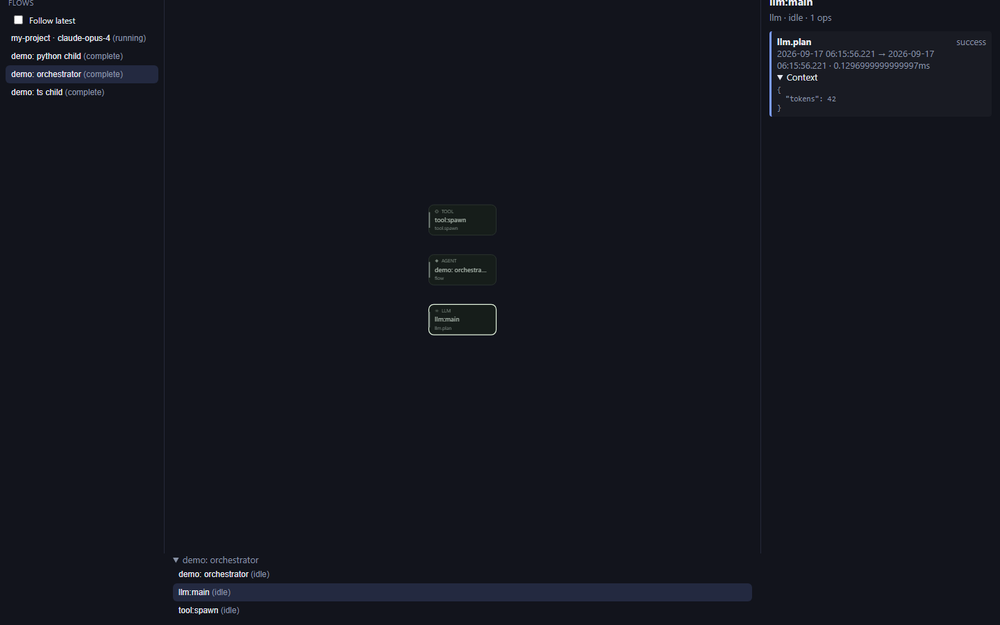
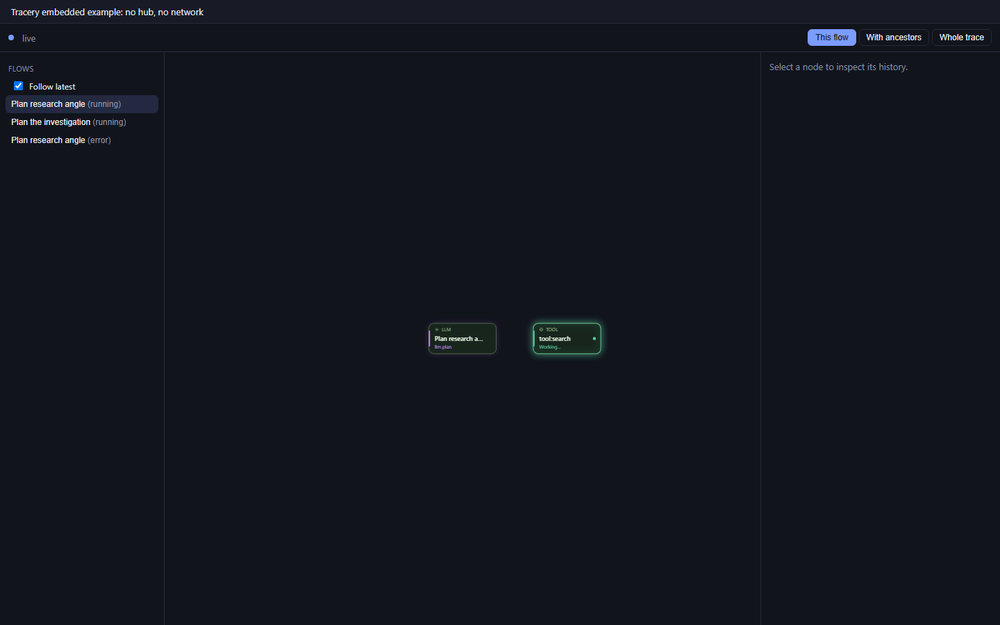
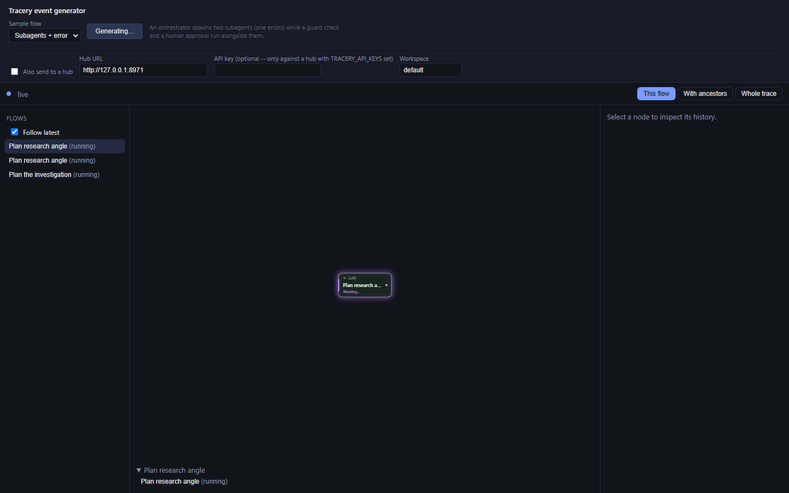
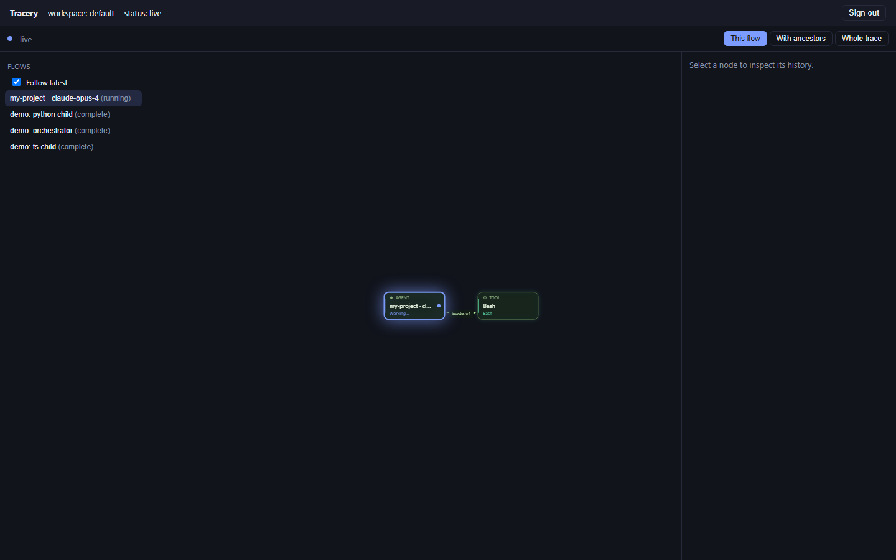
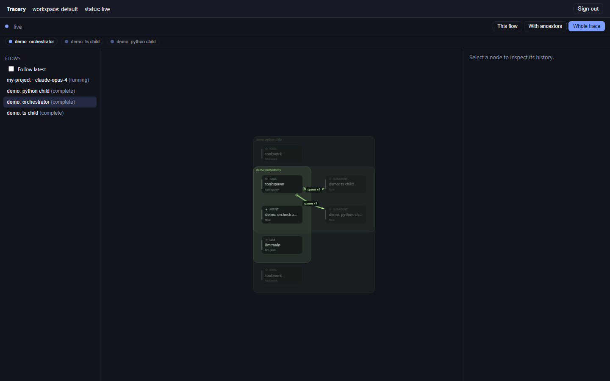
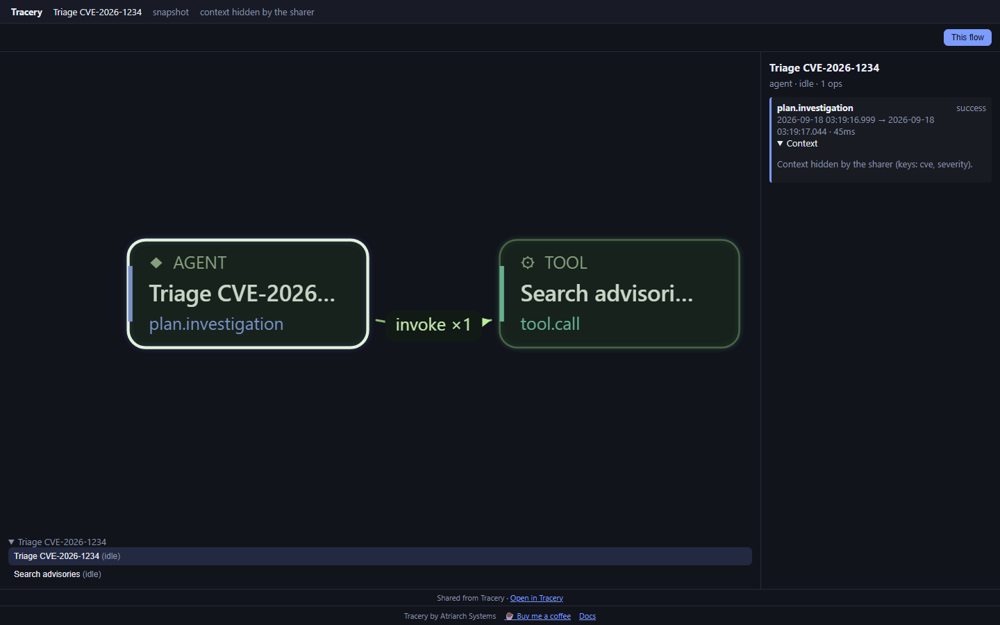

# Demos

> **Source release:** npm packages and prebuilt Docker images are not published yet.
> Follow the [source checkout/build instructions](../README.md) first; run the
> commands below from the repository root.

Three ways to see Tracery run, one per distribution mode from the root
[README](../README.md#usage-modes): the Claude Code plugin, the npm library
(no server), and the standalone hub — plus a fourth section on sharing
(`docs/SHARING.md`), a feature of the hub rather than its own distribution
mode. Each section below is self-contained: what it demonstrates, the exact
commands, what you should see, a screenshot, and a short
capabilities/limitations table for that version specifically (sourced from
the root [README](../README.md) and [`CLOUD.md`](CLOUD.md)).

All three assume a hub is already running. The commands below target the
demo hub used to build these screenshots: a Docker container named
`tracery-demo` on `http://127.0.0.1:8971`, SQLite-backed, with API key
`tdk_a7f3c9e2b1d4` (workspace `default`, roles `ingest`/`read`/`admin`). Swap
in your own `TRACERY_HUB_URL`/`TRACERY_API_KEY` for any other hub.

The root README's hero image and GIF (an orchestrator planning, searching,
and spawning two concurrent subagents — one succeeds, one errors — while a
guard check and a human approval run alongside them, in whole-trace scope
with a node selected to show real context) are captured the same way, by
[`scripts/capture-hero.mjs`](../scripts/capture-hero.mjs): a throwaway hub of
its own (never `tracery-demo`), the exact event schedule from
[`examples/embedded/src/scenario.ts`](../examples/embedded/src/scenario.ts)
replayed as real `/v1/events` calls while a headless browser records video,
then `ffmpeg` encodes a palette-optimized GIF. Regenerate with
`node scripts/capture-hero.mjs` (requires `ffmpeg` on `PATH`).

## 1. Claude Code plugin

**What it demonstrates**: `plugins/claude-code` turning a Claude Code
session into its own live flow graph on the hub, with zero code in the
session itself — just the plugin's twelve hooks mapping to Activity events
(see [`CLAUDE-CODE-PLUGIN.md`](CLAUDE-CODE-PLUGIN.md)). `scripts/demo-plugin.sh`
(or `.ps1`) proves the whole pipeline works before you ever open a real
session: it checks the hub is up, pipes a `SessionStart` and one
`PreToolUse`/`PostToolUse` pair through the plugin's real
`hooks/emit.mjs` for a synthetic session id, confirms the resulting flow
landed on the hub, and prints both the deep link `/tracery:activity` would
give you and the exact command to launch a real session against the same
hub.

**Commands**:

```sh
# smoke-test the mapper end to end and print the launch command
bash scripts/demo-plugin.sh
# or, on Windows:
pwsh scripts/demo-plugin.ps1

# then, to actually run a session with the plugin live:
TRACERY_HUB_URL=http://127.0.0.1:8971 TRACERY_API_KEY=tdk_a7f3c9e2b1d4 TRACERY_WORKSPACE=default \
  claude --plugin-dir plugins/claude-code
```

**What the viewer should see**: the script prints `hub is reachable`, then
three `[demo-plugin] piping ... through hooks/emit.mjs` lines, then
`confirmed: GET /v1/flows/demo-plugin-smoke -> 200` followed by that flow's
JSON (a `session` root op with one linked `tool:Bash` op), then:

```
[demo-plugin] smoke-test flow's deep link: http://127.0.0.1:8971/ui/flows/demo-plugin-smoke
[demo-plugin] general pattern (what /tracery:activity prints for the running session):
  http://127.0.0.1:8971/ui/flows/<session_id>

[demo-plugin] launch command for a new Claude Code session with the plugin
[demo-plugin] pointed at the demo hub:

TRACERY_HUB_URL=http://127.0.0.1:8971 TRACERY_API_KEY=tdk_a7f3c9e2b1d4 TRACERY_WORKSPACE=default claude --plugin-dir "<abs path>/plugins/claude-code"
```

Opening either deep link in a browser shows that flow in the same hosted
explorer the standalone hub demo below uses — a running Claude Code session
renders exactly like any other producer's activity.

**No-key alternative**: the commands above target the fixed-key demo hub
used for these screenshots. Against a hub you start yourself with
`node apps/hub/bin/hub.mjs` (local mode, no `TRACERY_API_KEYS`, task: "local
mode"), the whole quick start drops the key entirely:

```sh
node apps/hub/bin/hub.mjs
TRACERY_HUB_URL=http://127.0.0.1:8971 scripts/demo-plugin.sh   # or: TRACERY_API_KEY= scripts/demo-plugin.sh
TRACERY_HUB_URL=http://127.0.0.1:8971 claude --plugin-dir plugins/claude-code
```



**Capabilities / limitations** (this distribution, [`CLAUDE-CODE-PLUGIN.md`](CLAUDE-CODE-PLUGIN.md)):

| Capability | Detail |
| --- | --- |
| Needs a hub | yes — `TRACERY_HUB_URL` + an `ingest`-role `TRACERY_API_KEY`; both unset is a deliberate, silent no-op |
| Offline behavior | spools unsent events to `${CLAUDE_PLUGIN_DATA}/spool.ndjson` and drains it on the next hook invocation once the hub is reachable again |
| Persistence | none of its own — whatever the target hub provides |
| Redaction | full prompt text, Bash command text, file contents, tool output content and full error/stack traces are never sent; prompts only sent when `TRACERY_INCLUDE_PROMPTS=true` |
| Subagent correlation | a heuristic keyed on the `Agent` tool call's description; the spawn edge is omitted (not guessed) when two or more in-flight `Agent` calls share one description |
| Session overhead | one Node process per hook, ≤5s timeout, always exits 0 — a telemetry failure never blocks or fails the user's turn |
| Own UI | none — view sessions through the hub's hosted UI or HTTP API |

## 2. npm library (no server)

**What it demonstrates**: `@atriarch/tracery-core` + `@atriarch/tracery-react`
embedded directly in a page with no hub and no network at all — the
"library" usage mode. `examples/embedded` creates an in-process `Journal`,
runs a scripted synthetic agent (an orchestrator that plans, searches, and
spawns two subagent flows via `link` — one of which errors), and renders
`ActivityExplorer` full-screen through `useJournalSource`. Every event is
timed with real `setTimeout`s so the graph visibly animates over about 20
seconds, then loops with fresh flow ids so there's always something new to
watch.

**Commands**:

```sh
npm install                                    # links examples/embedded as a workspace
npm run build -w tracery-example-embedded      # tsc --noEmit + vite build
npm run dev -w tracery-example-embedded        # http://localhost:5173, live-reloading
# or, the production build used for the screenshot below:
npm run preview -w tracery-example-embedded    # http://localhost:4312
```

**What the viewer should see**: a full-screen explorer under a one-line
header ("Tracery embedded example: no hub, no network"). Within a couple of
seconds a flow ("Plan the investigation") appears and starts running; a few
seconds later two more flows ("Plan research angle" x2) spawn from its
search node, one of which ends in `error`. Connection status reads `live`
throughout — there is no hub to disconnect from. After roughly 20 seconds
the whole thing ends and starts over with new flow ids.



**Capabilities / limitations** (this distribution, [README](../README.md) "Quick start: library", [`packages/react/README.md`](../packages/react/README.md)):

| Capability | Detail |
| --- | --- |
| Server required | none — `Journal` and `ActivityExplorer` run entirely in the browser |
| Persistence | none — `Journal` is in-memory only; a page reload discards all history |
| Capacity | bounded by `maxEvents` (default 50,000 events); oldest events are evicted and the source's `partial` flag turns true |
| Multi-viewer / cross-process | no — one `Journal` per page; nothing is shared between tabs, processes, or machines |
| UI feature set | the full `ActivityExplorer` (flow picker, guided graph, inspector, scope switching) — the same component the hosted UI uses |
| RBAC / audit / SSO | not applicable — those are Tracery Cloud concerns (`docs/CLOUD.md`) this mode never touches |

### 2b. The event generator — the same library, on demand instead of looping

`examples/embedded` above is a fixed, auto-looping demo. `examples/generator`
is the interactive version: pick **Simple flow** or **Subagents + error**
from a dropdown, click **Generate**, and watch the exact same
`ActivityExplorer` draw it — but on your click, not on a 20-second loop. It
also has an **Also send to a hub** checkbox that posts the identical events
to a running hub over `POST /v1/events` at the same time, so the library
view and the hub's own hosted UI can be compared side by side from one
click.

```sh
npm run dev -w tracery-example-generator       # http://localhost:5173
# separately, to try the hub half:
node apps/hub/bin/hub.mjs                      # local mode, no key needed
```

Check the box, leave the hub URL at its default
(`http://127.0.0.1:8971`), leave the API key blank, click **Generate**, and
an **Open in hub ↗** link appears once the hub accepts the first batch.



This is also the fastest way to notice a hub that predates CORS support (any
hub built before this example was added rejects the browser's preflight
silently — see `apps/hub/README.md` "Cross-origin requests").

## 3. Standalone hub

**What it demonstrates**: `@atriarch/tracery-hub` as the aggregation point
for multiple producers — a TypeScript client and a Python client both
spawning subagent flows from one parent, resolved into a single trace and
served to any number of viewers through the hosted UI. `scripts/demo.mjs`
drives this against a running hub and asserts on the result (three flows in
one trace, exactly two spawn edges, a live WebSocket subscription that
receives every event, and duplicate-detection on re-ingest).

**Commands**:

```sh
# hub already running (see apps/hub/README.md for docker run / compose)
TRACERY_HUB_URL=http://127.0.0.1:8971 TRACERY_API_KEY=tdk_a7f3c9e2b1d4 node scripts/demo.mjs

# then, to reproduce the screenshots below:
node scripts/capture-screens.mjs
```

**What the viewer should see**: `scripts/demo.mjs` prints `PASS` for all 9
checks and ends with `ALL CHECKS PASSED`. Opening `http://127.0.0.1:8971/ui/`
and entering the API key shows three flows (`demo: orchestrator`,
`demo: ts child`, `demo: python child`); switching to *Whole trace* draws
all three as one graph with two spawn edges; selecting a node shows its op
history and merged context in the inspector.






**Capabilities / limitations** (this distribution, [README](../README.md) "Status", [`CLOUD.md`](CLOUD.md)):

| Capability | Detail |
| --- | --- |
| Storage | `memory` (default; nothing survives a restart) or `sqlite` (durable, single file, the demo hub's mode) |
| Replicas | single-replica only — `replicas: 1`, `strategy: Recreate`; no Postgres-backed store or multi-replica HA yet (roadmap) |
| Flow index | in-memory, rebuilt from the store on every boot |
| Live feed | `WS /v1/live`, reconnects with backoff; the React source falls back to polling after two consecutive failures |
| Auth | `node apps/hub/bin/hub.mjs` (or any loopback-bound hub) with no `TRACERY_API_KEYS` runs "local mode" -- no key, single `default` workspace, full access; otherwise static API keys (`TRACERY_API_KEYS`/`_FILE`), each bound to one workspace + roles, or a `*` operator key naming a workspace per request; no OIDC/SSO yet (roadmap) |
| Tracery Cloud / self-hosted enterprise | audit log + RBAC scopes + SSO, offered by a separate `HubExtensions` module (`docs/CLOUD.md`), not part of this repository; the community hub is fully functional — ingest, storage, retention, live feed, hosted UI — with no extensions module at all |
| Retention / export | bounded by `TRACERY_RETENTION_HOURS`; no workspace-level data export beyond the audit log's own NDJSON export (roadmap) |

## 4. Sharing

**What it demonstrates**: the viral loop (`docs/SHARING.md`) — the hosted
UI's **Share** button turning one flow into a link nobody needs an API key
to open, with producer context hidden by default. `/s/<token>` serves the
same `ActivityExplorer` in a read-only, locked-to-that-flow mode: no flow
picker (there is nothing else to pick — the share only ever carries its
own target's data), a "Shared from Tracery · Open in Tracery" footer, and
a "Context hidden by the sharer" notice wherever redacted context would
otherwise show up as a JSON blob.

**Commands**:

```sh
# against any running hub -- swap in your own TRACERY_HUB_URL/TRACERY_API_KEY
curl -s -X POST "$TRACERY_HUB_URL/v1/shares" \
  -H "authorization: Bearer $TRACERY_API_KEY" -H "content-type: application/json" \
  -d '{"target":{"type":"flow","id":"<flow-id>"},"mode":"snapshot","includeContext":false}'
# -> { "id": "...", "token": "...", "url": "http://.../s/<token>" }; open "url" in a
# browser with no key configured at all.

# the screenshot below was captured with its own throwaway hub (never the
# shared tracery-demo container), via the same script the other screenshots use:
CAPTURE_ONLY=share node scripts/capture-screens.mjs
```

**What the viewer should see**: opening the share URL with no session at
all goes straight to the graph — no key-entry screen, ever, for a share
page. The header names the shared flow, its mode (`snapshot`/`live`), and
a "context hidden by the sharer" badge when applicable; selecting the node
shows the inspector's redacted-context notice instead of the hidden
values themselves.



**Capabilities / limitations**:

| Capability | Detail |
| --- | --- |
| Auth | none on any public route (`/v1/shares/:token/*`, `WS .../live`, `/s/:token`) — the token in the path is the entire credential; creating/listing/revoking a share still needs a `read`-role API key (or local mode) |
| Modes | `snapshot` (capped at the hub cursor when created; immutable forever after) or `live` (uncapped, streams new events) |
| Redaction | `includeContext: false` (the default) replaces every context value with `{ _redacted, keys, bytes }`; never partial -- either the whole context is visible or none of it is |
| Expiry / revocation | 7/30/90 days or never, set at creation; revoke any time via `DELETE /v1/shares/:id`; an unknown, expired, or revoked token 404s identically |
| Rate limit | 60 requests/minute per source IP on every public route, in-memory (not shared across `postgres`-backed multi-replica deployments) |
| Offline fallback | `GET /v1/flows/:id/export.html` / `/v1/traces/:id/export.html` — a single downloadable, fully self-contained `.html` file with no network dependency at all, for local mode or anywhere a link can't reach |
| Image export | `ActivityGraphHandle.toImage()` renders the current view (with the Tracery mark) to a PNG, client-side, no server round trip |
